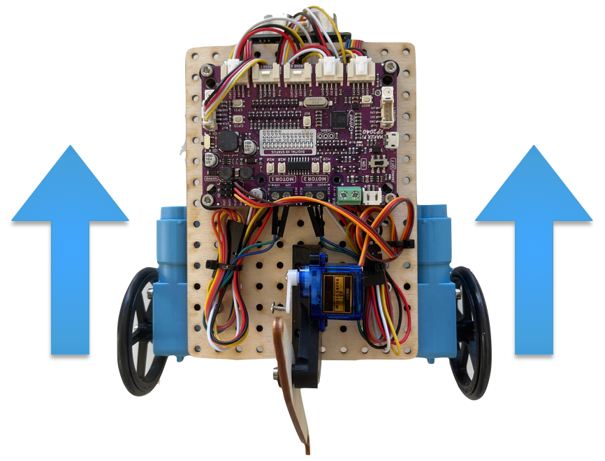
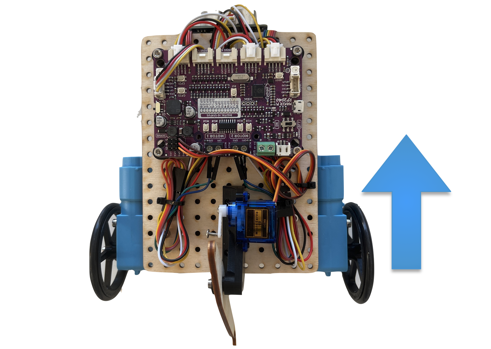
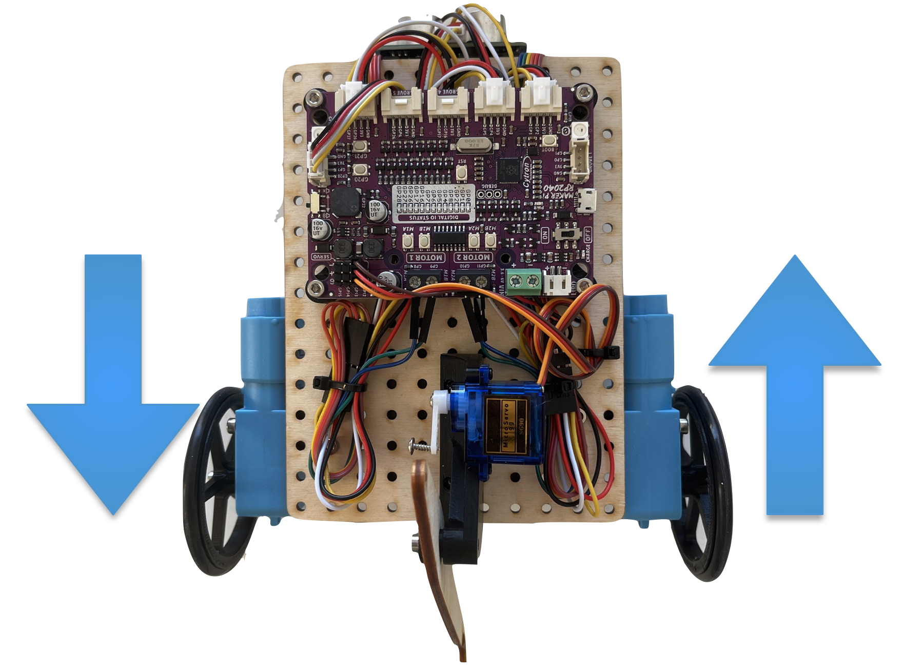

Getting the robot to move
=========================

Controlling the robots driving

Differential steering
---------------------
One of the things that you'll want to do is control the direction that your robot drives. Since there is no steering wheel like you would find on a car, the way to control the robot is by varying the wheel speeds relative to each other. This is called differential steering because the difference in wheel speeds controls the direction of the robot.

Driving straight
----------------
When both the left wheels and the right wheels are moving forward at the same speed, the robot will drive in a straight line. This is illustrated in the following image where the wheel speeds are shown by the length and direction of the arrows:

* Both arrows going forward means the wheels are turning in a direction that causes the robot to move forward and

* The length of the arrows being equal indicates the wheels are each going at the same speed.

	
	Robot with both wheels turning forward at the same speed. The robot drives forward in this case.

Turning
-------
When turning there are a variety of paths that the robot might follow from making a gentle curving turn to a hard right or left turn in place. All of these variations can be achieved using differential steering where the difference in speed and direction of the wheels will cause the robot to make various types of turns. We'll look at various turning requirements and see how each one can be accomplished by changing the motor and wheel speeds.

Making a sweeping turn right or left
^^^^^^^^^^^^^^^^^^^^^^^^^^^^^^^^^^^^

To make the robot make a left or right turn the wheels turn at different speeds. If the left wheel turns faster than the right wheel, the left side of the robot tries to get ahead of the right side, resulting in a right turn. Similarly, if the right wheel turns faster than the left, the robot turns to the left. Here is an example of wheel speeds that will cause the robot to turn to the left.

.. figure:: leftTurn.png
	:scale: 50%
	
	Robot with a difference in the wheel speeds
	
A robot with the right wheel turns faster than the left wheel causing the robot to turn to the left.

The radius of the turn depends on the difference between the wheels, a larger difference between the wheel speeds results in a tighter and a smaller radius turn, while a smaller difference results in a wider turn and a larger radius.

Making a *swing* turn
^^^^^^^^^^^^^^^^^^^^^

If one of the wheels is not moving at all while the other wheel is turning, then the robot will make a *swing* turn where the center of the rotation of the robot will be on the non-moving wheel. For example, if the right wheel is turning and the right wheel is fixed, then the robot will make a turn that pivots on the left (non-moving) wheel.

	
	A swing turn rotating on the left wheel.

The robot's path is circular with the turning wheel (right side) forming the outside of the circle and the radius of the circle will be wheel track (distance between the wheel centers).

Point turn
^^^^^^^^^^

Another type of turn is often referred to as a point turn where the left and right wheels turn in at an equal speed but in opposite directions. With this turn, the center of rotation is a point approximately between the left and right wheels. This is used for making, for example, a 90-degree turn in place.

	
	Point turn causes the robot will turn in place.

