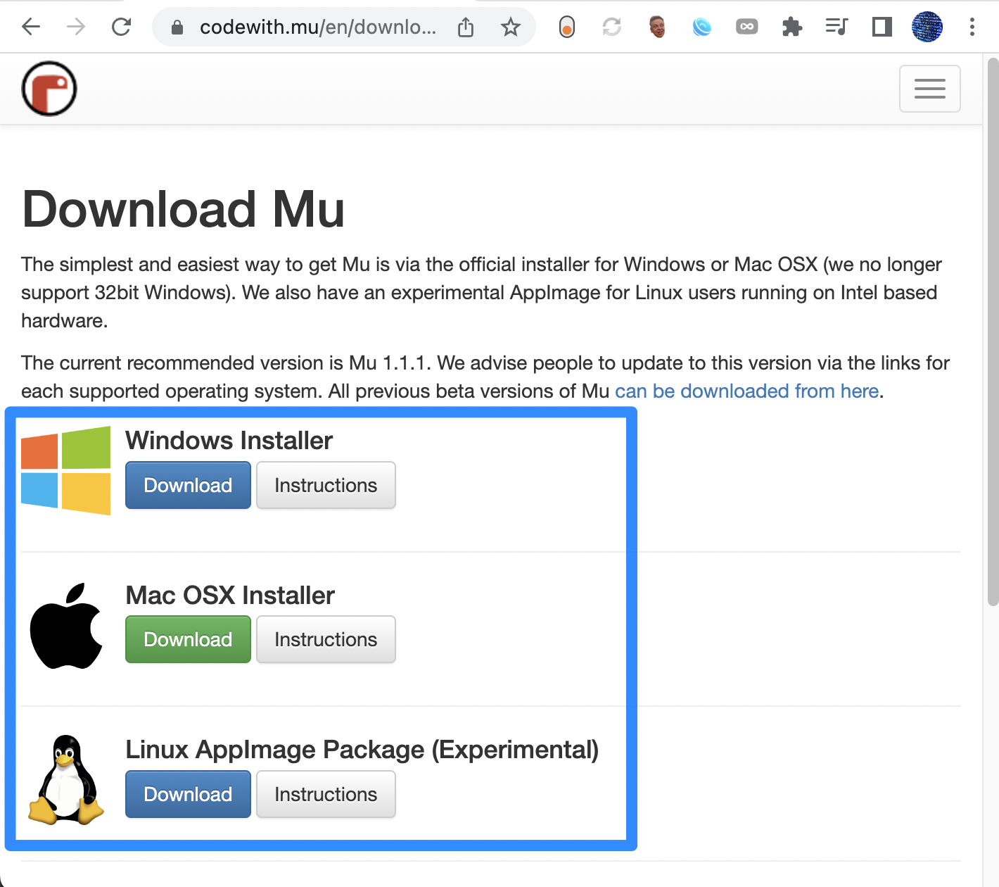

Setting up the code
=============

Mu Installation
----------------

Mu is a simple and concise editor that allows us to edit our CircuitPython code, and view serial output from our robot. To install, go to the following webpage: https://codewith.mu/en/download

You'll see a page like this:

Download the file corresponding to your operating system, and then open the file and follow the installation prompts that pop up.

Mu gives you the option to run different implementations of Python for different microcontrollers. In our case, we want to run CircuitPython, which is compatible with our Maker Pi RP2040. Select the "Mode" button shown below.
.. figure:: selectmode.png
	:scale: 50%

Now, select CircuitPython and confirm by clicking 'Ok'.
.. figure:: selectmode2.png
	:scale: 50%
